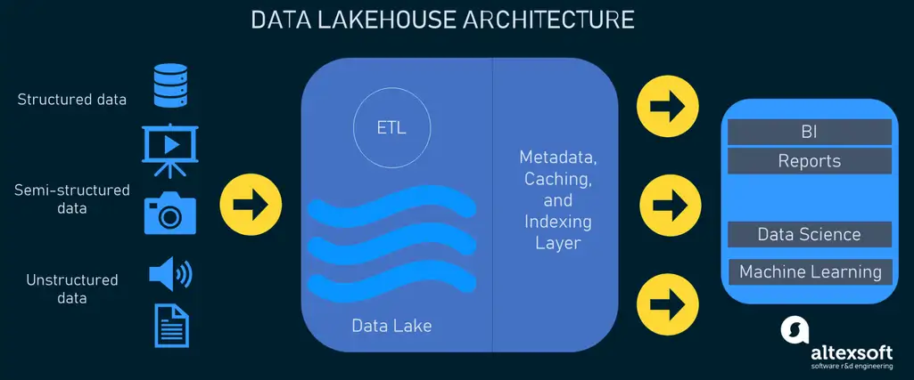

<h1 style="color: #2c3e50; font-size: 36px; font-weight: bold; text-align: center; padding: 20px; background-color: #ecf0f1; border-bottom: 4px solid #3498db;">
  Data Architecture Reference Framework
</h1>

<h2 style="color: #2c3e50; font-size: 28px; font-weight: bold; margin-top: 30px; border-bottom: 2px solid #3498db; padding-bottom: 10px;">
  1. Introduction
</h2>

<h3 style="color: #34495e; font-size: 22px; font-weight: bold; margin-top: 25px;">
  1.1 Purpose of the Document
</h3>

As organizations increasingly adopt modern data architectures, it is essential to establish a structured approach that ensures scalability, governance, and efficiency. While modern data platforms offer greater flexibility and capabilities, they also introduce new complexities in architecture design, technology selection, and operational best practices.

This document serves as a guiding framework for designing and implementing a modern, well-governed, and high-performance data ecosystem. It outlines key architectural principles, best practices, and considerations to help organizations build scalable, secure, and business-aligned data platforms.

Rather than advocating for a specific technology stack, this document focuses on architectural patterns that can be implemented using various tools and platforms, including:
- Data Storage Formats: Apache Iceberg, Delta Lake, Apache Hudi, Snowflake Native Format, etc.
- Compute & Processing Engines: Apache Spark (on EKS), Flink, Snowflake, Starburst, etc.

<h3 style="color: #34495e; font-size: 22px; font-weight: bold; margin-top: 25px;">
  1.2 Scope and Objective of the Document
</h3>

The primary objective of this document is to provide a neutral, best-practice-based framework for designing modern data architectures. It aims to:

- Define the core principles of a Data Lakehouse architecture and its role in enterprise data strategy.
- Outline best practices for data ingestion, transformation, governance, security, and analytics to ensure an efficient and well-managed data ecosystem.
- Enable informed decision-making by presenting agnostic architectural guidelines that can be applied across different technologies.
- Support engineering and architecture teams in implementing robust data solutions that align with both technical and business requirements.

This document is intended to serve as a reference framework and does not:

- Define a specific implementation roadmap for any individual use case.
- Serve as a migration guide for legacy architectures.
- Recommend a single vendor or technology solution for all scenarios.

<h3 style="color: #34495e; font-size: 22px; font-weight: bold; margin-top: 25px;">
  1.3 Intended Audience
</h3>

This document is designed for technology and data teams involved in architecting, developing, and governing modern data platforms. It provides guidance for:

- Enterprise & Data Architects – To establish a strategic data architecture framework.
- Data Engineering & Platform Teams – To implement ingestion, transformation, and processing layers.
- Governance & Security Teams (Chief Data Office - CDO) – To ensure compliance, lineage tracking, and data protection.
- Analytics & BI Teams – To optimize query performance and reporting capabilities.

<h2 style="color: #2c3e50; font-size: 28px; font-weight: bold; margin-top: 30px; border-bottom: 2px solid #3498db; padding-bottom: 10px;">
   2. The Evolution of Data Architectures
</h2>

Data architectures have evolved significantly over the past few decades, adapting to changing business needs, advances in technology, and the exponential growth of data. While traditional data warehouses have provided structured, governed, and high-performance analytics, the growing need to process semi-structured and unstructured data at scale led to the emergence of data lakes.

However, neither solution alone fully meets the diverse needs of modern enterprises. This led to the emergence of the Data Lakehouse, a hybrid approach that combines the governance and performance of data warehouses with the scalability and flexibility of data lakes.

This section explores the evolution of data architectures, highlighting their capabilities, limitations, and how Lakehouse architectures address modern data challenges.

<h3 style="color: #34495e; font-size: 22px; font-weight: bold; margin-top: 25px;">
   2.1 Comparison of Architectures
</h3>

<h4 style="color: #2c3e50; font-size: 20px; font-weight: bold; margin-top: 20px;">
   2.1.1 Traditional Data Warehouses (Structured, High-Performance, Governed Analytics)
</h4>

   Data warehouses have a long history in decision support and business intelligence applications. Since their inception in the late 1980s, they have been the foundation for structured analytics, supporting complex queries and ensuring data integrity through ACID transactions.
  
   Over time, Massively Parallel Processing (MPP) architectures allowed data warehouses to scale horizontally, significantly improving their ability to handle large volumes of structured data. However, as enterprises began to collect semi-structured and unstructured data, new challenges emerged.
   
   **Strengths of Data Warehouses:**
   - High-performance structured query execution (optimized for relational data).
   - Strong governance and schema enforcement (data quality, auditing, security).
   - ACID transactions ensure data reliability and consistency.
   - Optimized for business intelligence and analytical workloads.
   
   **Challenges of Traditional Warehouses:**
   - Limited support for semi-structured and unstructured data (e.g., JSON, images, videos, IoT streams).
   - Not designed for real-time data processing (batch-oriented architecture).
   - Can be costly for high-volume workloads due to proprietary storage and compute costs.
   - Data movement overhead – Requires ETL pipelines to ingest data into structured formats.

   As organizations sought more flexibility and scalability, the Data Lake emerged as a solution for managing diverse data formats and large-scale analytics.

<h4 style="color: #2c3e50; font-size: 20px; font-weight: bold; margin-top: 20px;">
   2.1.2 Data Lakes (Scalable, Flexible, Cost-Effective Storage)
</h4>

  With the explosion of big data, organizations needed a way to store raw, high-volume data in its native format. Data Lakes were introduced as low-cost, scalable repositories, allowing enterprises to store structured, semi-structured, and unstructured data in formats such as Parquet, Avro, and JSON.

   **Strengths of Data Lakes:**
   - Supports all data types – Structured, semi-structured, and unstructured data.
   - Cost-efficient storage – Cloud-based object stores (e.g., AWS S3, ADLS, GCS) reduce infrastructure costs.
   - Decouples storage and compute – Enables flexibility in analytics tools and processing engines.
   - Allows data science and machine learning workloads to work with raw data.
   
   **Challenges of Data Lakes:**
   - Lack of ACID transactions – No built-in mechanisms to enforce data consistency.
   - Data governance complexities – No native schema enforcement leads to data swamp issues.
   - Query performance limitations – Requires additional optimizations for analytical workloads.
   - Difficult to mix batch and streaming jobs due to a lack of consistency controls.
   
   While data lakes solved scalability and flexibility concerns, they introduced challenges in governance, consistency, and performance. To address these limitations, enterprises started adopting hybrid architectures, leading to the emergence of the Lakehouse model.

<h4 style="color: #2c3e50; font-size: 20px; font-weight: bold; margin-top: 20px;">
   2.1.3 Data Lakehouse (Unified Governance, Performance, Scalability)
</h4>

  The Data Lakehouse combines the best elements of data lakes and data warehouses, addressing key limitations of both architectures. It supports open formats, ACID transactions, and schema enforcement while maintaining flexibility for diverse workloads such as BI, data science, real-time processing, and machine learning.

   **Key Features of the Data Lakehouse:**
   - Transaction Support – Ensures consistency as multiple pipelines read and write concurrently.
   - Schema Enforcement & Governance – Supports structured modeling, governance, and auditing.
   - BI & Analytics Compatibility – Enables SQL-based querying directly on the source data.
   - Decoupled Storage & Compute – Leverages cloud object stores with scalable processing engines.
   - Openness & Interoperability – Uses open table formats (Apache Iceberg, Delta Lake, Apache Hudi).
   - Support for Structured & Unstructured Data – Works with text, images, video, and IoT streams.
   - Unified Workloads – Supports SQL, ML, real-time analytics, and batch processing.
   - End-to-End Streaming Support – Enables real-time data ingestion and analysis.

   **Comparison of Data Lakehouse Features with Traditional and Data Lake Architectures:**

   | Feature                    | Traditional Data Warehouse | Data Lake                        | Lakehouse                    |
   |----------------------------|----------------------------|----------------------------------|------------------------------|
   | Data Type Support          | Structured                 | All types, but lacks governance  | Structured & unstructured    |
   | ACID Transactions          | Yes                        | No                               | Yes                          |
   | Schema Enforcement         | Yes                        | No                               | Yes                          |
   | BI & SQL Support           | Strong                     | Limited                          | Strong                       |
   | Machine Learning & AI      | Limited                    | Yes                              | Yes                          |
   | Compute-Storage Separation | No                         | Yes                              | Yes                          |
   | Real-Time Streaming        | No                         | No                               | Yes                          |
   | Cost Efficiency            | Expensive at scale         | Low-cost storage                 | Balanced                     |

   **Benefits and Adoption Drivers of Data Lakehouses:**
   - Best of Both Worlds – Combines governance of data warehouses with flexibility of data lakes.
   - Open & Standardized – Supports open formats, reducing vendor lock-in.
   - Simplified Architecture – Reduces complexity by minimizing data movement across systems.
   - Supports Modern Workloads – Enables AI, machine learning, and real-time analytics at scale.

<h3 style="color: #34495e; font-size: 22px; font-weight: bold; margin-top: 25px;">
   2.2 Need for Modern Architecture
</h3>

As enterprises evolve, their data needs are no longer confined to traditional business intelligence and reporting. The increasing demand for real-time insights, machine learning, and multi-modal analytics has necessitated a modern approach that seamlessly integrates diverse workloads while ensuring governance, performance, and scalability.

The Data Lakehouse addresses these challenges by bringing together structured governance from data warehouses and the scalability and cost efficiency of data lakes. Below are the key drivers behind its adoption:

**Key Benefits and Adoption Drivers of Data Lakehouses**

1. **Unified Platform for All Workloads**
   - Supports SQL-based analytics, machine learning, data science, and real-time streaming on a single platform.
   - Eliminates the need for multiple, specialized systems, reducing data movement and duplication.

2. **Openness & Interoperability**
   - Uses open table formats (Apache Iceberg, Delta Lake, Apache Hudi), reducing vendor lock-in.
   - Supports a variety of processing engines (Spark, Trino, Presto, Flink, Dask) for flexibility.

3. **Cost Optimization & Scalability**
   - Separates compute from storage, allowing enterprises to scale resources independently and optimize costs.
   - Leverages low-cost cloud object storage while maintaining structured query performance.

4. **Governance, Security & Compliance**
   - Implements schema enforcement, access control, and audit logging similar to traditional data warehouses.
   - Ensures data integrity with ACID transactions while allowing for schema evolution.

5. **Support for Multi-Structured Data**
   - Integrates structured, semi-structured, and unstructured data (text, images, videos, IoT data, JSON).
   - Enables advanced AI/ML applications that require complex data types.

6. **End-to-End Streaming & Real-Time Processing**
   - Supports batch and streaming analytics in a single system, eliminating the need for separate real-time systems.
   - Enables low-latency insights for fraud detection, recommendation systems, and operational monitoring.

By adopting Data Lakehouse architectures, enterprises can modernize their data ecosystems while maintaining governance, cost efficiency, and scalability, ensuring long-term adaptability to emerging data needs.

<h3 style="color: #34495e; font-size: 22px; font-weight: bold; margin-top: 25px;">
   2.3 Key Architectural Pillars of a Lakehouse
</h3>

A Lakehouse architecture is built on three core principles that differentiate it from traditional data architectures. These pillars ensure flexibility, efficiency, and governance, making it a strategic choice for modern enterprises.

<h4 style="color: #2c3e50; font-size: 20px; font-weight: bold; margin-top: 20px;">
2.3.1 Open Table Formats (Interoperability & Storage Efficiency)
</h4>

Lakehouses rely on open, standardized table formats to store and manage data, ensuring compatibility across multiple compute engines.

Key Technologies:
- Apache Iceberg: Provides ACID transactions, time-travel queries, and schema evolution.
- Delta Lake: Offers strong governance, transactional integrity, and efficient data versioning.
- Apache Hudi: Optimized for incremental data processing with record-level updates and deletes.

Why This Matters:
- Eliminates proprietary storage limitations.
- Allows schema enforcement and evolution without downtime.
- Supports incremental updates, deletes, and fast rollback capabilities.

<h4 style="color: #2c3e50; font-size: 20px; font-weight: bold; margin-top: 20px;">
2.3.2 Decoupled Compute & Storage (Scalability & Cost Optimization)
</h4>

Unlike traditional monolithic architectures, Lakehouses separate compute and storage layers, enabling flexible resource allocation and cost efficiency.

Key Technologies:
- Apache Spark : Distributed compute for large-scale ETL, analytics, and AI/ML workloads.
- Apache Flink: Real-time stream processing engine for low-latency analytics.
- Trino, Dremio, Databricks SQL Engine, Snowflake, Google Bigquery & etc.: Query engines optimized for federated querying across structured and unstructured data.

Why This Matters:
- Scale compute resources independently of storage to optimize performance and cost.
- Supports multiple query engines without data movement.
- Enables concurrent workloads (batch, real-time, ML) on shared storage.

<h4 style="color: #2c3e50; font-size: 20px; font-weight: bold; margin-top: 20px;">
2.3.3 Unified Governance & Access Control (Security & Compliance)
</h4>

As enterprises scale data usage across teams, ensuring proper governance and security is critical. A Lakehouse provides fine-grained access control, data lineage tracking, and compliance enforcement within a unified system.

Key Technologies:
- Unity Catalog, Snowflake, AWS Lake Formation, Apache Ranger: Provide centralized access control and data lineage tracking.
- Column-level security & data masking: Protect sensitive PII data while maintaining usability.
- RBAC (Role-Based Access Control) & ABAC (Attribute-Based Access Control): Define access permissions at a granular level.

Why This Matters:
- Ensures regulatory compliance (GDPR, HIPAA, SOC 2) through auditable data access.
- Prevents data leaks with fine-grained security policies.
- Simplifies data access across multiple teams with centralized governance.

<h2 style="color: #2c3e50; font-size: 28px; font-weight: bold; margin-top: 30px; border-bottom: 2px solid #3498db; padding-bottom: 10px;">
   3. Architectural Overview
</h2>

<h3 style="color: #34495e; font-size: 22px; font-weight: bold; margin-top: 25px;">
   3.1 Business Drivers for Modern Data Platforms
</h3>

Modern enterprises generate, process and analyze massive volumes of data across structured, semi-structured and unstructured formats. Legacy architectures such as traditional data warehouses, were designed for structured data and analytical reporting, but they lack flexibility, scalability and cost efficiency for today's diverse data needs. The Data lakehouse architecture has emerged as a response to business-critical challenges in handling data efficiently while ensuring governance, real-time processing and interoperability.

The Data Lakehouse architecture has emerged as a response to business-critical challenges in handling data efficiently while ensuring governance, real-time processing and interoperability 

**Key Business Challenges Addressed by Modern Data Platforms**

- Explosion of Data Volumes & Variety
  - Financial Organizations for an example must ingest and process diverse financial data from sources such as transactional systems, real-time payments, IoT (ATMs, POS terminals), trading platforms, market data feeds, and credit bureaus.
  - Semi-structured (JSON, Parquet, Avro) and unstructured data (audio transcripts, financial documents, chat logs, KYC) must be efficiently processed.
  - Traditional data warehouses were not built for large-scale semi/unstructured data processing, making modern architectures essential.
  
- Need for real-Time & AI-Driven Insights
  - Traditional batch processing cannot support real-time business decisions.
  - AI-driven applications, such as fraud detection, anti-money laundering (AML) transaction monitoring, credit risk modeling, and regulatory stress testing, require low-latency access to up-to-date data.
  - Streaming architectures integrated with modern data platforms enable real-time decision-making.
  
- Growing Security & Compliance Requirements
  - Regulatory frameworks like GDPR, PCI-DSS, CCAR, KYC & AML demand fine-grained access control, data lineage tracking, data-masking and auditability.
  - Data sovereignty laws require organizations to manage data residency effectively.
  - Traditional architectures struggle with enforcing modern security policies across multi-cloud and hybrid environments.
  
- Cost & performance Optimization
  - Financial Organizations such as Banks handle high-frequency transactions, market data analytics, and regulatory reporting, all requiring efficient data processing.
  - Organizations need decoupled compute-storage architectures to optimize costs dynamically.
  - Open-source table formats (Apache Iceberg, Delta Lake, Hudi) provide cost-efficient storage management while maintaining high query performance.
  
- Breaking down Data Silos and democratizing data access across the organization.
  - Siloed architectures prevent seamless data sharing across teams (BI, AI/ML, and Operations).
  - Data as a Product & Data Mesh architectures enable distributed data ownership and self-service access.
  - Open standards (Parquet, Deltalake, Iceberg) improve cross-platform interoperability.
  
- Unified Architecture for Multi-modal Workloads
  - Businesses require a single platform to support BI, AI/ML, real-time analytics, and operational reporting, so Data Lakehouse unifies these workloads while ensuring governance, performance, and scalability.

<h3 style="color: #34495e; font-size: 22px; font-weight: bold; margin-top: 25px;">
   3.2 High-Level Architecture
</h3>

The Lakehouse architecture represents a paradigm shift in modern data platforms, seamlessly blending the scalability and flexibility of data lakes with the robust governance and performance characteristics of data warehouses. This multi-layered architecture is designed to support a wide array of workloads, including batch processing, real-time streaming, business intelligence, machine learning, and advanced analytics.

**Key Components of a Lakehouse Architecture:**

1. **Data Ingestion Layer:** 
   This layer serves as the entry point for data from diverse sources, efficiently handling both batch and streaming ingestion. It employs a variety of protocols and connectors to integrate with internal systems, external APIs, IoT devices, and other data producers, ensuring a seamless flow of information into the Lakehouse.

2. **Data Storage Layer:** 
   At the core of the Lakehouse is a cost-effective, scalable object storage system (e.g., AWS S3, Azure Blob Storage). This layer leverages open file formats like Parquet or ORC, enabling direct access to data objects through various APIs and consumption tools. The separation of storage from compute allows for independent scaling and optimization of resources.

3. **Metadata & Governance Layer:** 
   This critical layer differentiates the Lakehouse from traditional data lakes. It provides a unified catalog and robust metadata management capabilities, including:
   - ACID transaction support for data consistency
   - Efficient caching and indexing mechanisms
   - Zero-copy cloning for data versioning and experimentation
   - Schema enforcement and evolution
   - Fine-grained access control and auditing

   Technologies like Delta Lake and Apache Iceberg have pioneered these capabilities, significantly enhancing data management and query performance.

4. **API & Processing Layer:** 
   This layer exposes a rich set of APIs and processing engines to support diverse analytical workloads. It includes:
   - SQL query engines for traditional analytics
   - Distributed processing frameworks like Apache Spark for large-scale data transformation
   - Machine learning libraries such as TensorFlow and PyTorch for advanced analytics
   - Streaming processors like Apache Flink for real-time data handling

   The unified nature of the Lakehouse allows these tools to operate directly on the underlying data, eliminating the need for data duplication and ensuring consistency across different processing paradigms.

5. **Consumption Layer:** 
   The topmost layer provides seamless integration with a wide array of business intelligence, visualization, and machine learning tools. This enables data scientists, analysts, and business users to derive insights using their preferred tools while maintaining a single source of truth. The Lakehouse model democratizes data access across the organization, fostering a data-driven culture while maintaining robust governance and security controls.

By adopting this architecture, organizations can significantly reduce data silos, improve data quality, and accelerate time-to-insight while maintaining the flexibility to adapt to evolving business needs and technological advancements.

While this section provided a high-level overview of the Lakehouse architecture and its key components, the next section will dive into the detailed implementation of each layer, covering best practices, technology choices, and architectural considerations in depth.

<h3 style="color: #34495e; font-size: 22px; font-weight: bold; margin-top: 25px;">
   3.3 Functional Layers & Team Responsibilities (Should we go for this one ?)
</h3>

<h2 style="color: #2c3e50; font-size: 28px; font-weight: bold; margin-top: 30px; border-bottom: 2px solid #3498db; padding-bottom: 10px;">
   4. Layered Architecture & System Components
</h2>

A well-defined layered architecture ensures that data moves through the system in a controlled, efficient, and scalable manner. Unlike traditional monolithic architectures, where storage, compute, and governance are tightly coupled, the Lakehouse separates these concerns, allowing for greater flexibility, cost-efficiency, and workload optimization.

While the previous section provided a high-level overview of the Lakehouse, this section serves as the technical deep dive, breaking down each layer's functionality, implementation best practices, and technology choices.

<h3 style="color: #34495e; font-size: 22px; font-weight: bold; margin-top: 25px;">
   4.1 Ingestion Layer
</h3>

The Ingestion Layer is the foundational component of a Lakehouse Architecture, ensuring that data from diverse sources is efficiently ingested into the system in a structured, reliable, and scalable manner. This layer plays a crucial role in enabling both batch and streaming data pipelines, ensuring low-latency data availability for real-time processing and analytics.

**1. Role & Importance of the Ingestion Layer**

The ingestion layer is responsible for:
- Data Acquisition: Collecting data from multiple internal and external sources.
- Data Movement & Pipeline Orchestration: Managing ETL (Extract, Transform, Load) and ELT (Extract, Load, Transform) workflows.
- Schema Management: Inferring and enforcing schemas dynamically or manually.
- Latency Handling: Supporting low-latency real-time ingestion and high-throughput batch ingestion.
- Scalability & Reliability: Handling petabyte-scale data ingestion with resilience against failures.

This layer serves as the entry point for data into the Lakehouse, ensuring that data is structured, enriched with metadata, and delivered efficiently into the Storage Layer.

**2. Key Functions of the Ingestion Layer**

The ingestion process is designed to handle multiple data types, ingestion frequencies, and processing modes:

**2.1 Batch Ingestion (Scheduled & Large Data Movement)**

Batch ingestion is ideal for structured and semi-structured datasets where periodic updates are sufficient. This is common in enterprise reporting, data warehousing, and historical analytics.

- Characteristics:
  - Suitable for large-scale data movement.
  - Usually operates on a scheduled cadence (e.g., daily, hourly).
  - May include data transformations before storage.
- Common Data Sources:
  - Relational Databases (OLTP, Data Warehouses, CRM, ERP).
  - Flat Files (CSV, Parquet, ORC).
  - APIs & External Data Sources.
  - Third-party Enterprise Applications.
- Technologies & Tools:
  - Batch Processing Pipelines: Apache Airflow, AWS Glue, Informatica, Azure Data Factory etc.
  - Database Extraction Tools: AWS DMS, Oracle GoldenGate etc.
  - Storage Integration: AWS S3, Azure Blob, Google Cloud Storage, Minio etc.

**2.2 Streaming Ingestion (Real-time, Event-driven Data)**

Streaming ingestion ensures low-latency data availability and is critical for real-time analytics, fraud detection, operational intelligence, and AI-driven applications.

- Characteristics:
  - Captures and processes data in motion.
  - Supports event-driven architectures.
  - Enables continuous data availability for real-time reporting & AI.
- Common Data Sources:
  - Change Data Capture (CDC) Streams from databases.
  - Real-time event streams from enterprise applications and microservices.
  - Log & telemetry data from applications & cloud services.
  - Streaming APIs (RESTful services, WebSockets).
- Technologies & Tools:
  - Message Queues & Event Brokers: Apache Kafka, AWS Kinesis, Google Pub/Sub etc.
  - Stream Processing Engines: Apache Flink, Apache Spark Structured Streaming, Kafka Streams etc.
  - Change Data Capture (CDC) Tools: Debezium, GoldenGate etc.

**3. Schema Inference & Evolution**

- Schema Inference: Automatically detects and applies schema definitions from source data.
- Schema Evolution: Allows updates to schema structures over time without breaking existing pipelines.
- Schema Enforcement: Ensures data integrity, preventing ingestion of malformed or incompatible data.

💡 Example: When ingesting JSON logs, schema evolution ensures that newly added fields do not disrupt existing downstream analytics.

**4. Ingestion Patterns & Best Practices**

| Pattern                           | Use Case                                                       | Implementation Strategy                          |
|-----------------------------------|----------------------------------------------------------------|--------------------------------------------------|
| Batch ETL (Scheduled Jobs)        | Periodic ingestion from structured systems (DWH, OLTP)         | Workflow orchestration tools, ETL platforms      |
| Change Data Capture (CDC)         | Near real-time updates from transactional databases            | Database replication tools, CDC-specific solutions|
| Event-Driven Streaming            | Continuous data flow from IoT, applications, logs              | Distributed streaming platforms, message queues  |
| Hybrid (Lambda/Kappa Architectures)| Combining batch + streaming for real-time & historical insights| Unified batch and stream processing frameworks   |

**5. Key Design Considerations**

1. Latency Requirements → Define whether batch, real-time, or hybrid ingestion suits the use case.
2. Data Volume & Scalability → Ensure the pipeline can handle high-throughput ingestion.
3. Schema Governance & Evolution → Enforce schema evolution without disrupting consumers.
4. Data Reliability & Resilience → Implement retry mechanisms and idempotent processing to handle failures.
5. Integration with Storage & Processing Layers → Align ingestion methods with downstream data consumption.

A well-architected Ingestion Layer ensures that data flows into the Lakehouse reliably, efficiently, and at scale. Whether dealing with batch ingestion from enterprise databases or real-time event streams from IoT & applications, the Lakehouse Ingestion Layer must be designed to provide low-latency, schema-aware, scalable, and resilient data delivery.

This layer forms a critical foundation for downstream data analytics, AI/ML, and business intelligence pipelines. With a robust ingestion strategy in place, the next challenge lies in efficient storage, management, and query optimization of incoming data. In the following section, we'll explore the Storage Layer, examining how table formats, partitioning strategies, and schema evolution collectively contribute to enhanced performance and cost efficiency in the Lakehouse architecture.

<h3 style="color: #34495e; font-size: 22px; font-weight: bold; margin-top: 25px;">
   4.2 Data Storage & Table Formats (Best Practices for Selecting File Formats & Storage Strategies)
</h3>

The Lakehouse architecture decouples compute from storage, allowing organizations to store vast amounts of raw, curated, and transformed data in a single repository while using multiple processing engines (e.g., Spark, Trino, Presto, Snowflake, Flink) for query execution.

**Key Principles of an Effective Storage Layer:**
- **Unified Storage** – Supports raw, refined, and aggregated data in open formats.
- **Columnar Storage Formats** – Uses Parquet, ORC, and Avro for high-performance analytics.
- **Transaction Support** – Implements ACID transactions via Delta Lake, Iceberg, or Hudi to maintain data consistency.
- **Schema Evolution & Time Travel** – Enables historical queries, rollback capabilities, and schema flexibility.
- **Partitioning, Compaction & Indexing** – Reduces query latency and improves storage efficiency.

<h4 style="color: #2c3e50; font-size: 20px; font-weight: bold; margin-top: 20px;">
   4.2.1 Open Table Formats
</h4>

In modern data architectures, data lakes have long provided scalability, flexibility, and cost-efficiency, but they lacked robust governance, schema enforcement, and transactional consistency. The rise of Lakehouse architectures has introduced the need for structured management over raw data while maintaining the advantages of scalable storage in cloud object stores.

Open table formats solve this challenge by introducing structured metadata, schema management, and ACID transactions directly into data lakes. These formats act as an abstraction layer between raw storage (Parquet, ORC, Avro) and compute engines (Spark, Trino, Presto, Snowflake, etc.), enabling a structured, warehouse-like experience while maintaining the scalability of a data lake.

<h4 style="color: #34495e; font-size: 20px; font-weight: bold; margin-top: 20px;">
   What is an Open Table Format?
</h4>

An open table format is a metadata layer that sits atop columnar storage formats (e.g., Parquet, ORC, Avro) and enables transactionality, schema evolution, and indexing for data lake storage.

Unlike traditional data warehouses, where storage and compute are tightly coupled, open table formats allow multiple processing engines to efficiently read, write, and query data while ensuring governance, consistency, and performance optimization.

<h4 style="color: #34495e; font-size: 20px; font-weight: bold; margin-top: 20px;">
   OTF Metadata Layer
</h4>

- **Schema Information** – Defines table structure, including column names, data types, and nested structures.
- **Partition Information** – Specifies partition values and ranges to optimize query execution.
- **Statistical Information** – Includes row counts, null counts, and min/max values to enhance query performance.
- **Commit History** – Tracks all table modifications (inserts, updates, deletes, schema changes) for time travel and version control.
- **Data File Paths** – Stores references to physical data files and their partition mappings.

<h4 style="color: #34495e; font-size: 20px; font-weight: bold; margin-top: 20px;">
   Key Features of Open Table Formats
</h4>

- **ACID Transactions** – Ensures consistency and reliability for concurrent operations.
- **Schema Evolution** – Allows table schema modifications (adding, renaming, removing columns) without breaking existing queries.
- **Time Travel & Data Versioning** – Enables querying historical snapshots of data for auditing and debugging.
- **Optimized Query Performance** – Supports indexing, partitioning, and file compaction to enhance analytics.
- **Multi-Engine Compatibility** – Works seamlessly with Spark, Trino, Flink, Snowflake, and other query engines.

<h4 style="color: #34495e; font-size: 20px; font-weight: bold; margin-top: 20px;">
   How OTF Works in a Lakehouse
</h4>

Open Table Formats act as a bridge between raw storage and compute layers, ensuring that data is well-managed, versioned, and optimized for querying across multiple workloads.

| Layer           | Purpose                                                                           | Examples                                                |
|-----------------|-----------------------------------------------------------------------------------|--------------------------------------------------------|
| Lake Storage    | Stores raw data files (Parquet, ORC, Avro) in cloud object stores                 | AWS S3, Azure Data Lake, Google Cloud Storage           |
| File Format     | Defines how data is structured at a file level                                    | Parquet, ORC, Avro                                      |
| Table Format    | Manages metadata, transactions, schema evolution, and indexing                    | Delta Lake, Iceberg, Hudi                               |
| Storage Engine  | Optimizes file layout, clustering, and compaction for better performance          | Delta Engine, Iceberg Storage Manager                   |
| Compute Engine  | Reads and writes data using table format APIs for analytics and machine learning  | Apache Spark, Trino, Flink, Snowflake                   |

<h4 style="color: #34495e; font-size: 20px; font-weight: bold; margin-top: 20px;">
   How OTF Supports Open Data Architecture
</h4>

Adopting Open Table Formats (OTF) such as Delta Lake, Iceberg, or Hudi is a crucial step toward building a truly open and interoperable data architecture. These formats eliminate proprietary table lock-in, enabling organizations to seamlessly integrate diverse storage and compute engines while maintaining ACID guarantees, schema evolution, and efficient data management at scale.

However, a fully open architecture extends beyond table formats—it requires openness across catalogs, storage engines, and governance layers to ensure true flexibility. By embracing open standards, organizations gain greater control over their data, avoid vendor dependencies, and future-proof their platforms, allowing them to adapt to evolving business and technological needs without being constrained by proprietary ecosystems.

Now that we have established the importance of Open Table Formats in ensuring structured, governed, and ACID-compliant data management in a Lakehouse, the next challenge is optimizing storage for performance and cost efficiency. In the next section, we will explore storage optimization techniques, including partitioning, compaction, and indexing, to ensure that Lakehouse queries are both fast and scalable.

<h4 style="color: #2c3e50; font-size: 20px; font-weight: bold; margin-top: 20px;">
   4.2.1 Storage Optimization Strategies
</h4>

In a Lakehouse architecture, efficient storage management is critical to ensuring high query performance, reduced costs, and scalable data processing. While open table formats provide governance and transactionality, how data is physically stored and managed can significantly impact query speed, compute resource usage, and overall system efficiency.

**Key Strategies :**
- Partitioning: Organizing data for faster queries and reduced scan times.
- File Compaction: Minimizing small file issues to enhance query efficiency.
- Indexing: Enabling faster data retrieval through metadata-driven optimizations.
- Data Layout Optimization: Improving data locality and reducing unnecessary I/O scans.

---
•	4.3.1 The Role of the Storage Layer in a Lakehouse
•	4.3.2 Open Table Formats (Delta, Iceberg, Hudi)
•	4.3.3 Data Partitioning, Compaction & Indexing Best Practices
•	4.3.4 Schema Evolution & Data Versioning
•	4.3.5 Disaster Recovery & Backup Strategies

<h3 style="color: #34495e; font-size: 22px; font-weight: bold; margin-top: 25px;">
   4.3 Metadata, Catalog & Governance (Schema enforcement, access control, and lineage tracking)
</h3>

<h2 style="color: #2c3e50; font-size: 28px; font-weight: bold; margin-top: 30px; border-bottom: 2px solid #3498db; padding-bottom: 10px;">
   5. Data Mesh & Data Product
</h2>

	•	Ingestion & Streaming Strategies (Best practices for handling structured & unstructured data)
	•	Transformations & Data Modeling (Defining robust, scalable data models)
	•	Data Lakehouse ETL/ELT Best Practices (Optimizing performance & cost-efficiency)
	•	Pipeline Monitoring & Observability (Tracking lineage, latency & quality)

<h2 style="color: #2c3e50; font-size: 28px; font-weight: bold; margin-top: 30px; border-bottom: 2px solid #3498db; padding-bottom: 10px;">
   6. AI/ML Integration & Advanced Use Cases
</h2>

	•	How AI/ML Fits into the Lakehouse Model
	•	Feature Engineering & Model Training
	•	MLOps: Model Deployment & Governance
	•	Generative AI & Large-Scale Analytics

<h2 style="color: #2c3e50; font-size: 28px; font-weight: bold; margin-top: 30px; border-bottom: 2px solid #3498db; padding-bottom: 10px;">
   7. Bringing It All Together (Summary)

   	•	Key Takeaways from the Document (Highlighting essential best practices & strategies)
	•	How to Implement This in Your Organization (Guidance on adoption & roll-out)
	•	Future Roadmap & Evolving Trends (How modern data architectures will evolve further)
	•	Call to Action for Teams (Next steps for different teams to enable success in the organization)
</h2>